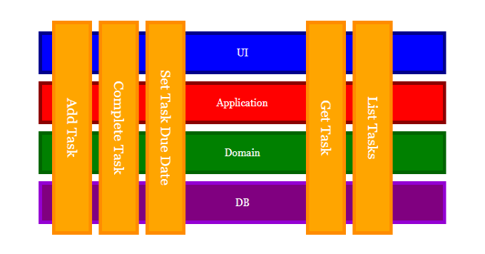

# Slice
An example of an application using "Vertical Slices" architecture

## Docs
[Philosophy](docs/philosophy.md)

[Sample](docs/sample_workflow.md)

[Contrast With N-Tier](docs/contrast_data_access.md)

## References

[Vertical Slices Article](https://jimmybogard.com/vertical-slice-architecture/)  By *Jimmy Bogard*

This impelmenetation was inspired by Scott Walshin's talk ["Reinventng the Transaction Script"](https://www.youtube.com/watch?v=USSkidmaS6w)

### Projects Used

[Asp.Net Core](https://github.com/dotnet/aspnetcore) - Web Stack

[Fluent Validation](https://fluentvalidation.net/) - Request Validation

[Dapper](https://stackexchange.github.io/Dapper/) - Micro Orm

[Refit](https://reactiveui.github.io/refit/) - Api Client

[Brighter](https://paramore.readthedocs.io/en/latest/) - Command Library

[Darker](https://github.com/BrighterCommand/Darker) - Query Library

[Polly](https://github.com/App-vNext/Polly) - Policy Library
 
[ReSpawn](https://github.com/jbogard/respawn) - Database Integration Testing
